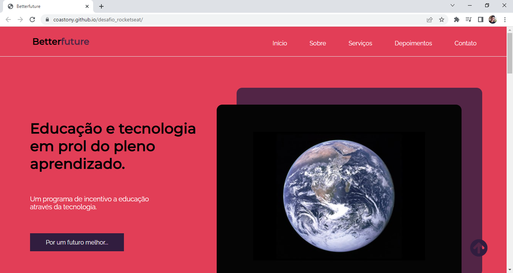

<h1 align="center">DoWhile 2021</h1>
 
 
 
 ## ✔️ Techniques and technologies used

- ``HTML5`` ``CSS3`` ``JavaScript`` ``Google Fonts``

- "Pensando em construir o futuro, como você solucionaria os problemas de acesso à educação hoje, utilizando a tecnologia?" 
- Desafio RocketSeat HTML5 | CSS3 | JavaScript 
- DoWhile 2021
- Finished in Dec/2021 and updated in Mar/2023

 

 

## 📁 Project access
You can access the project files by clicking [here](https://github.com/Coastony/countdown)
